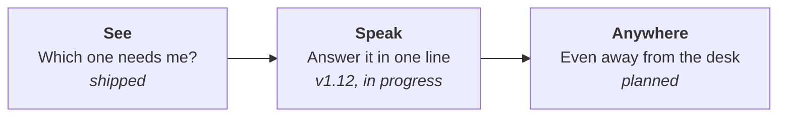
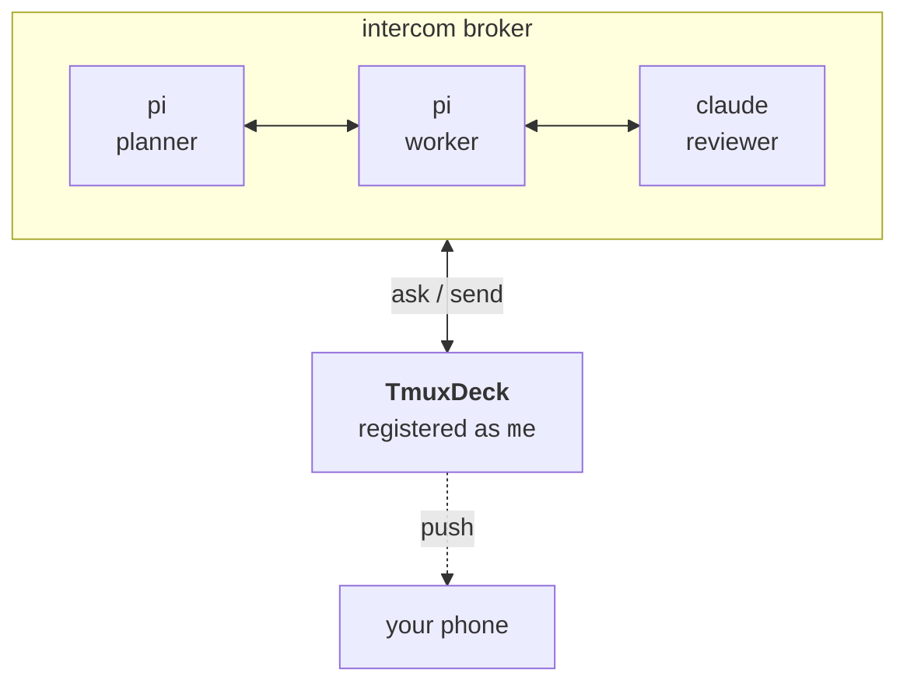

# TmuxDeck

*[English](README.md) · [简体中文](README.zh-CN.md)*

**Ten agents are running. Which one is waiting for you?**

TmuxDeck is a control surface for working with many AI coding agents at once. Each agent runs in its own tmux pane; TmuxDeck shows you all of them, tells you which one needs a human, and lets you answer it.

Built with [Tauri](https://tauri.app/). macOS is the primary platform; Windows works through WSL.

---

## At a glance

- **Orchestrate many agents at once.** Every workspace is a card; every pane shows what's running and how long it has been quiet.
- **Native Ghostty splits.** 1/2/4/6-pane grids, each agent in its own tmux session — close the window, the agent keeps working.
- **Plays well with classic setups.** Plain terminals and tmux multi-pane layouts are fully supported.
- **Runs what you already use.** Pi, Claude Code, Codex, OpenCode, Gemini CLI, Aider, custom commands, or a plain shell — detected at runtime.
- **One-click control.** Create, start, resume, kill a single agent, or destroy a whole workspace from the dashboard.
- **Lives in the menu bar.** Close the window and it keeps running — status, previews, and control stay one click away.
- **Agents find each other.** Registers on the Agent Intercom broker for cross-harness discovery, live status, and directed messaging.
- **macOS first, WSL-ready.** Built on Tauri; Windows runs through WSL.

---

## The idea

Running one agent is easy — you watch it. Running twelve is a different problem entirely.

They finish at different times. They block on questions you did not anticipate. They wait quietly, and a stalled agent looks exactly like a busy one. The work stops being *writing prompts* and starts being **triage**: out of everything running, which one needs me right now?

```
   ┌─ project-api ───────────┐   ┌─ mes-refactor ──────────┐
   │  ◐  pi        tool:bash │   │  ●  claude    thinking  │
   │  ○  pi        idle      │   │  ◐  codex     tool:edit │
   └─────────────────────────┘   └─────────────────────────┘

   ┌─ wms-migrate ───────────┐   ┌─ docs ──────────────────┐
   │  ●  pi        thinking  │   │  ▲  claude    waiting   │ ←── needs you
   │  ○  zsh                 │   │  ○  zsh                 │
   └─────────────────────────┘   └─────────────────────────┘

        ●  working      ◐  running a tool
        ○  idle         ▲  waiting for a human
```

That last card is the whole point. Everything else can wait.

---

## Three layers



**See** — every session is a card, every pane shows what is running and how long it has been quiet. One click reattaches in your terminal of choice. This is what ships today.

**Speak** — a stalled agent is only useful if you can unstick it. TmuxDeck can send text into any pane, so answering an agent does not require finding its window first.

**Anywhere** — the triage problem does not stop when you leave your desk. Agents that block at 9pm sit blocked until morning unless something reaches you.

---

## Agents already talk to each other. You were the missing participant.

Coding agents are growing their own coordination layer — [Agent Intercom](https://github.com/dataforxyz/agent-intercom-pi) gives Pi, Codex, Claude Code, and OpenCode sessions a shared local broker so they can find and message each other.

What that bus has no adapter for is **the human**.



TmuxDeck registers on that broker as a session named `me`. An agent that needs a decision addresses you the same way it would address another agent — and because the broker already tracks who is idle, who is thinking, and who is blocked waiting for a reply, **the "which one needs me" question is answered by data, not guesswork**.

> Status: the intercom client and secure WebSocket transport are implemented; the complete mobile client UI is still pending. See [docs/PRD-v1.12](docs/PRD-v1.12-conversation-bridge.md).

---

## Features

Shipped today:

- **Session overview.** Every tmux session is a card with window count, pane count, per-pane commands, and last-activity time.
- **One-click workspace creation.** Name a session, pick a directory, choose an agent, a pane count, and a terminal. Panes are created and the terminal opens automatically.
- **Works with what you have.** Terminals and agents are detected at runtime; uninstalled ones are hidden. Terminals: Ghostty, iTerm2, WezTerm, kitty, Alacritty, system Terminal. Agents: Claude Code, Codex, OpenCode, Gemini CLI, Aider, Pi, or a plain shell.
- **Lives in the menu bar.** Close the window and TmuxDeck keeps running — open a session, add a pane, or create a workspace without reopening the main window.
- **Pane-level control.** Hover a pane preview to kill just that pane, or add one to grow the grid.
- **No duplicate windows.** Clicking a session that is already open focuses its window instead of spawning another terminal.
- **Remembers your choices.** Last terminal, agent, and pane count persist to `~/.config/tmuxdeck/config.json`.
- **No setup required.** With nothing else installed, it falls back to the system terminal and your shell.

Conversation bridge foundation (v1.8): directed pane input, intercom broker client, structured transcripts, unified conversation model, and subscription-scoped WebSocket transport. The complete mobile UI remains in progress.

---

## Requirements

- macOS (Apple Silicon or Intel)
- [tmux](https://github.com/tmux/tmux) — `brew install tmux`

Terminals and agents are optional; the app offers only what you have installed.

## Installation

Download the latest release from the [Releases page](https://github.com/ctliz/TmuxDeck/releases) and drag the `.dmg` into Applications.

If macOS warns that the app cannot be verified, right-click it and choose Open, then confirm. This is expected for unsigned builds.

## Usage

1. Open TmuxDeck.
2. Click **New Workspace**.
3. Enter a name, pick a directory, choose the agent, pane count, and terminal.
4. Click **Create**.

The terminal opens attached to the new session. Closing the terminal window does not destroy the workspace — the session keeps running and can be reopened any time. Only the delete button on a card destroys a session.

## Configuration

Settings live in `~/.config/tmuxdeck/config.json` and are written automatically.

```json
{
  "default_terminal": "ghostty",
  "default_agent": "pi",
  "default_panes": 4,
  "custom_agent": { "name": "Claude Opus", "command": "claude --model opus" },
  "recent_dirs": ["/Users/you/projects/foo"]
}
```

`custom_agent` adds a user-defined agent command to the create dialog.

## FAQ

**Do I need Ghostty or Claude Code to use TmuxDeck?**

No. The app detects what is installed and hides what is not. With nothing installed it uses the system terminal and your shell.

**Will my agents be killed if I close TmuxDeck?**

No. Workspaces live in tmux, not in the app. Closing the app or a terminal window leaves sessions running. Only the delete button destroys a session.

**Do I need Agent Intercom?**

No. Without it TmuxDeck is the dashboard described above. With it, agent status becomes exact rather than inferred, and agents can address you directly.

**Why is a terminal missing from the options?**

Only installed terminals are shown. If a category has a single candidate, the row is hidden rather than shown as a fixed choice. If you installed one in a non-standard location and it is not detected, open an issue.

**Does TmuxDeck support Linux or Windows?**

Linux is not supported yet. Windows works through WSL and ships the same installers, but macOS is the battle-tested platform — please report Windows issues on GitHub.

## Development

See [CONTRIBUTING.md](CONTRIBUTING.md) for setup and code conventions, and [docs/](docs/README.md) for architecture, protocol reference, and decision records.

## License

[MIT](LICENSE)
