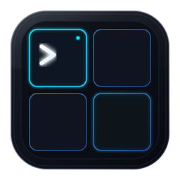

<div align="center">



# TmuxDeck

**再也不用记 tmux 会话名了。**

给你的 AI 编码 Agent 一个看得见的控制台 —— 点一下，多个 Agent 就在分屏里跑起来了。

[](https://github.com/ctliz/TmuxDeck/actions/workflows/build.yml)
[](LICENSE)

[](https://github.com/ctliz/TmuxDeck/releases)

[下载安装](#-安装) · [快速上手](#-30-秒上手) · [常见问题](#-常见问题)

</div>

<!--
  📸 待补：把应用主界面截图放到 docs/screenshot.png 后取消下面这行注释
  
-->

---

## 这是给谁用的

如果你经常这样干活：

- 同时开好几个项目，每个项目都想挂着 AI Agent 帮你写代码
- 用 tmux 管理它们，但**老是忘记会话叫什么名字**，每次都得 `tmux ls` 翻一遍
- 想开个「4 个 Agent 并行」的工作区，得手敲一长串 `split-window` 命令
- 终端关了之后，不确定哪些活儿还在后台跑着

那 TmuxDeck 就是给你的。它把 tmux 会话变成**一屏卡片**，谁在跑、跑的什么、开了几个分屏，一眼看完。想回到哪个，点一下就弹出终端。

## 它能做什么

**看得见** — 所有工作区以卡片呈现，每个分屏正在跑什么命令都写在上面。绿点表示正在使用中。

**一键创建** — 填个项目名，选好目录，点创建。4 个分屏、4 个 Agent，自动就位。

**用你自己的工具** — 你装了什么，它就用什么：

> **终端**　Ghostty · iTerm2 · WezTerm · kitty · Alacritty · 系统自带终端
> **Agent**　Claude Code · Codex · OpenCode · Gemini CLI · Aider · Pi · 或纯 Shell

没装的不会出现在界面上，不用你挑。还能自定义命令，比如 `claude --model opus`。

**记得你的习惯** — 上次用的终端、Agent、分屏数，下次自动带出来。目录用系统文件夹选择器点选，**全程不用手打路径**。

**不会把你卡住** — 就算一个第三方工具都没装，用系统自带终端 + Shell 照样能跑。

---

## 📦 安装

### 下载安装包（推荐）

前往 [Releases](https://github.com/ctliz/TmuxDeck/releases) 下载 `.dmg`,拖进「应用程序」即可。

> **首次打开提示「无法验证开发者」？**
> 这是因为安装包还没做 Apple 公证。右键点击 App 图标 → 选择「打开」→ 再点「打开」即可。只需操作一次。

### 唯一的前置要求

```bash
brew install tmux
```

就这一个。终端和 AI Agent 都是可选的 —— 没装也能用，只是选项会少一些。

---

## 🚀 30 秒上手

1. **打开 TmuxDeck**
2. 点 **新建工作区**
3. 填项目名 → 点 📁 选个目录 → 选 Agent、分屏数、终端
4. 点击创建 —— 终端自动弹出，Agent 已经在各个分屏里等着你了

关掉终端窗口**不会**销毁工作区，活儿还在后台跑。回到 TmuxDeck 点卡片上的「打开」就能随时接回来。

---

## ❓ 常见问题

<details>
<summary><b>我没装 Ghostty / Claude Code，能用吗？</b></summary><br>

能。TmuxDeck 会自动检测你装了什么，只显示可用的选项。哪怕一个都没装，也会用 macOS 自带的终端 + 你的 Shell 兜底，功能完全正常。

</details>

<details>
<summary><b>关掉 TmuxDeck，我的 Agent 会被杀掉吗？</b></summary><br>

不会。所有工作区都跑在 tmux 里，TmuxDeck 只是个控制台。关掉它、甚至关掉终端窗口，后台任务都继续跑。只有点卡片上的删除按钮才会真正销毁工作区。

</details>

<details>
<summary><b>为什么某个终端没出现在选项里？</b></summary><br>

TmuxDeck 只显示**已安装**的终端，避免给你无效选项。如果某一类只检测到一个可选项，那一整行会直接隐藏 —— 没得选的东西就不该来问你。

如果你装了但没被识别，多半是装在了非标准路径，欢迎 [提个 issue](https://github.com/ctliz/TmuxDeck/issues) 告诉我们路径。

</details>

<details>
<summary><b>支持 Linux / Windows 吗？</b></summary><br>

目前只支持 macOS。代码里的终端识别是按注册表结构写的，移植到 Linux 不难，欢迎 PR。

</details>

<details>
<summary><b>配置存在哪里？</b></summary><br>

`~/.config/tmuxdeck/config.json`,由应用自动读写，一般不用手改。里面记录你上次用的终端、Agent、分屏数和常用目录。

</details>

---

## 🤝 参与贡献

欢迎 issue 和 PR。想加个新终端或新 Agent 的支持？通常只需要改几行 —— 详见 **[CONTRIBUTING.md](CONTRIBUTING.md)**。

## 📄 License

[MIT](LICENSE) © TmuxDeck Contributors
