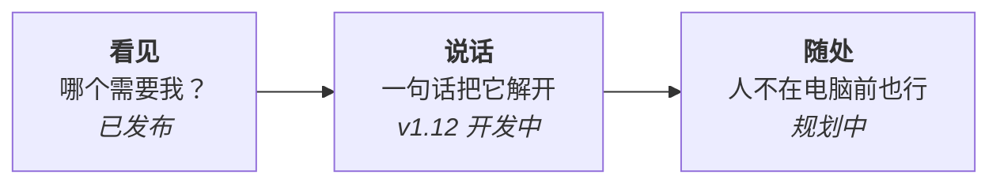
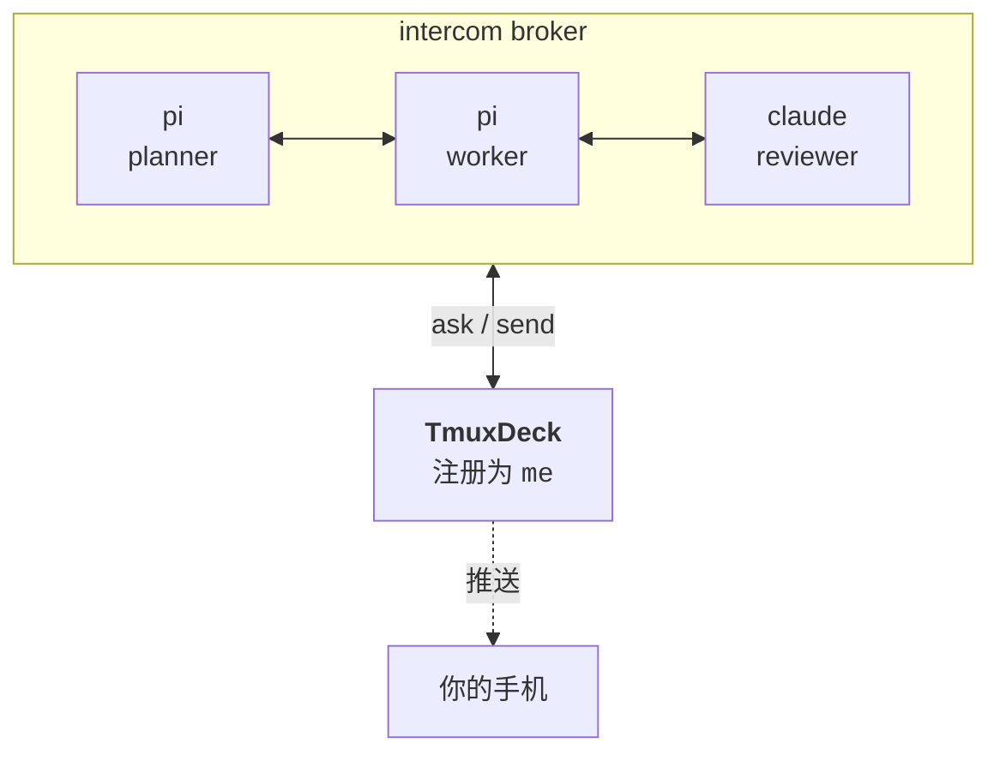

# TmuxDeck

*[English](README.md) · [简体中文](README.zh-CN.md)*

**十个 agent 在跑，哪一个在等你？**

TmuxDeck 是同时驾驭多个 AI 编码 agent 时的操作台。每个 agent 跑在自己的 tmux 分屏里，TmuxDeck 把它们全部呈现出来，告诉你哪一个需要人，并让你能直接回它。

基于 [Tauri](https://tauri.app/) 构建。macOS 为主要平台，Windows 通过 WSL 支持。

---

## 概述

- **同时驾驭多个 agent。** 每个工作区是一张卡片，每个分屏显示正在跑什么、安静了多久。
- **原生 Ghostty 分屏。** 1/2/4/6 分屏网格，每个 agent 独立 tmux 会话——关掉窗口，agent 照常干活。
- **兼容经典环境。** 原生终端与 tmux 多 pane 布局完全可用。
- **用你已经装了的工具。** Pi、Claude Code、Codex、OpenCode、Gemini CLI、Aider、自定义命令或纯 Shell——运行时自动检测。
- **一键掌控。** 创建、启动、恢复、单独终止某个 agent、销毁整个工作区，都在仪表盘上完成。
- **常驻菜单栏。** 关掉窗口继续运行——状态、预览与控制始终一键可达。
- **agent 之间互相发现。** 注册进 Agent Intercom broker，跨 harness 发现、实时状态与定向通信。
- **macOS 优先，WSL 可跑。** 基于 Tauri 构建；Windows 经 WSL 运行。

---

## 这个软件在解决什么

跑一个 agent 很简单——你盯着它就行。跑十二个，问题的性质就变了。

它们在不同时刻结束，会卡在你没预料到的问题上，然后安静地等着。而**一个卡住的 agent，看上去和一个正忙的 agent 一模一样**。工作的重心于是从「写提示词」变成了**分诊**：这么多东西在跑，现在到底哪一个需要我？

```
   ┌─ project-api ───────────┐   ┌─ mes-refactor ──────────┐
   │  ◐  pi        tool:bash │   │  ●  claude    思考中     │
   │  ○  pi        空闲       │   │  ◐  codex     tool:edit │
   └─────────────────────────┘   └─────────────────────────┘

   ┌─ wms-migrate ───────────┐   ┌─ docs ──────────────────┐
   │  ●  pi        思考中     │   │  ▲  claude    等待中     │ ←── 需要你
   │  ○  zsh                 │   │  ○  zsh                 │
   └─────────────────────────┘   └─────────────────────────┘

        ●  正在工作      ◐  正在执行工具
        ○  空闲          ▲  在等人
```

最后那张卡片就是全部意义所在。其他都可以再等等。

---

## 三层



**看见** —— 每个会话是一张卡片，每个分屏显示正在跑什么、安静了多久。点一下就在你选的终端里重新连上。这是今天已经能用的部分。

**说话** —— 卡住的 agent 只有能被解开才有意义。TmuxDeck 可以往任意分屏发送文本，回一个 agent 不再需要先找到它的窗口。

**随处** —— 分诊这件事不会因为你离开座位就停止。晚上九点卡住的 agent，如果没有东西来找你，就会一直卡到第二天早上。

---

## agent 之间已经能对话了，缺的那个参与者是你

编码 agent 正在长出自己的协作层——[Agent Intercom](https://github.com/dataforxyz/agent-intercom-pi) 让 Pi、Codex、Claude Code、OpenCode 的会话共用一个本地 broker，彼此可以发现并互发消息。

而这条总线上唯一没有适配器的，是**人**。



TmuxDeck 在那条总线上注册成一个名为 `me` 的会话。需要决策的 agent 找你的方式，和它找另一个 agent 完全一样。而由于 broker 本身就在跟踪谁空闲、谁在思考、谁正阻塞等待回复，**「哪个需要我」这个问题是被数据回答的，不是猜出来的**。

> 当前状态：intercom 客户端与安全 WebSocket 传输已实现，完整手机端 UI 仍待完成。详见 [docs/PRD-v1.12](docs/PRD-v1.12-conversation-bridge.md)。

---

## 功能

已发布：

- **会话总览。** 每个 tmux 会话以卡片呈现，含窗口数、分屏数、每个分屏的运行命令和最后活跃时间。
- **一键创建工作区。** 输入会话名、选目录、选 agent、分屏数和终端，分屏自动创建，终端自动打开。
- **用你已经装了的工具。** 运行时检测已安装的终端与 agent，未装的不显示。终端：Ghostty、iTerm2、WezTerm、kitty、Alacritty、系统终端。Agent：Claude Code、Codex、OpenCode、Gemini CLI、Aider、Pi，或纯 Shell。
- **常驻菜单栏。** 关掉窗口后仍在运行——不打开主窗口即可打开会话、新增分屏或建工作区。
- **分屏级管理。** 悬停分屏预览格可单独删除，也可新增分屏扩展网格。
- **不会重复开窗。** 点击已打开的会话会聚焦其已有窗口，而不是再拉起一个终端。
- **记住你的选择。** 上次的终端、agent、分屏数保存在 `~/.config/tmuxdeck/config.json`。
- **零配置。** 什么都没装时，回退到系统终端和默认 Shell。

对话桥基础能力（v1.8）：定向 pane 输入、intercom broker 客户端、结构化 transcript、统一对话模型与按订阅分发的 WebSocket 传输。完整手机端 UI 仍在开发中。

---

## 环境要求

- macOS（Apple Silicon 或 Intel）
- [tmux](https://github.com/tmux/tmux) —— `brew install tmux`

终端和 agent 都是可选的，应用只提供你已安装的选项。

## 安装

从 [Releases 页面](https://github.com/ctliz/TmuxDeck/releases) 下载最新版本，将 `.dmg` 拖入「应用程序」。

如果 macOS 提示无法验证开发者，右键点击应用图标选择「打开」并确认。这是未签名构建的预期行为。

## 使用

1. 打开 TmuxDeck。
2. 点击 **新建工作区**。
3. 输入名称，选择目录，然后选 agent、分屏数和终端。
4. 点击 **创建**。

终端会打开并连接到新会话。关闭终端窗口不会销毁工作区——会话继续运行，随时可从仪表盘重新打开。只有卡片上的删除按钮才会销毁会话。

## 配置

设置保存在 `~/.config/tmuxdeck/config.json`，由应用自动写入。

```json
{
  "default_terminal": "ghostty",
  "default_agent": "pi",
  "default_panes": 4,
  "custom_agent": { "name": "Claude Opus", "command": "claude --model opus" },
  "recent_dirs": ["/Users/you/projects/foo"]
}
```

`custom_agent` 用于向新建工作区对话框添加自定义 agent 命令。

## 常见问题

**必须装 Ghostty 或 Claude Code 吗？**

不需要。应用检测已安装的工具并隐藏未装的。什么都没装时使用系统终端和你的 Shell。

**关闭 TmuxDeck 会杀掉我的 agent 吗？**

不会。工作区运行在 tmux 里而非应用内。关闭应用或终端窗口都不影响会话，只有删除按钮才会销毁。

**必须装 Agent Intercom 吗？**

不必。没有它时，TmuxDeck 就是上面描述的那个仪表盘；有它时，agent 状态从推断变为精确，且 agent 可以直接找你。

**为什么某个终端没出现在选项里？**

只显示已安装的终端。某一类只有一个候选时整行会被隐藏，而不是显示为固定选项。若你装在非标准位置且未被识别，请提 issue。

**支持 Linux 或 Windows 吗？**

Linux 暂不支持。Windows 通过 WSL 可用并提供同样的安装包，但 macOS 是经过充分验证的平台——Windows 问题请在 GitHub 反馈。

## 开发

环境搭建与代码规范见 [CONTRIBUTING.md](CONTRIBUTING.md)，架构、协议参考与决策留痕见 [docs/](docs/README.md)。

## License

[MIT](LICENSE)
