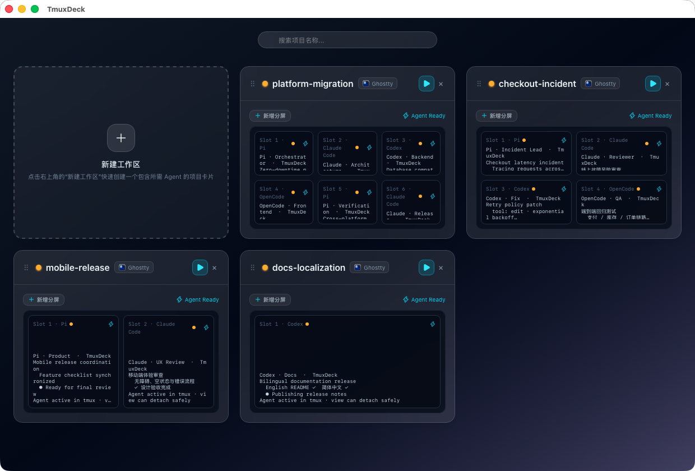
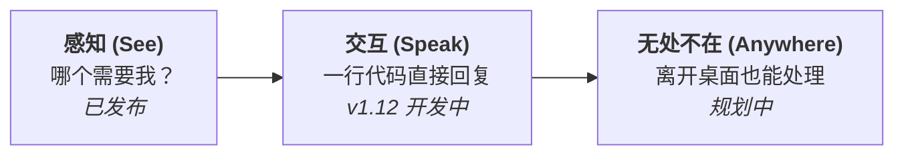
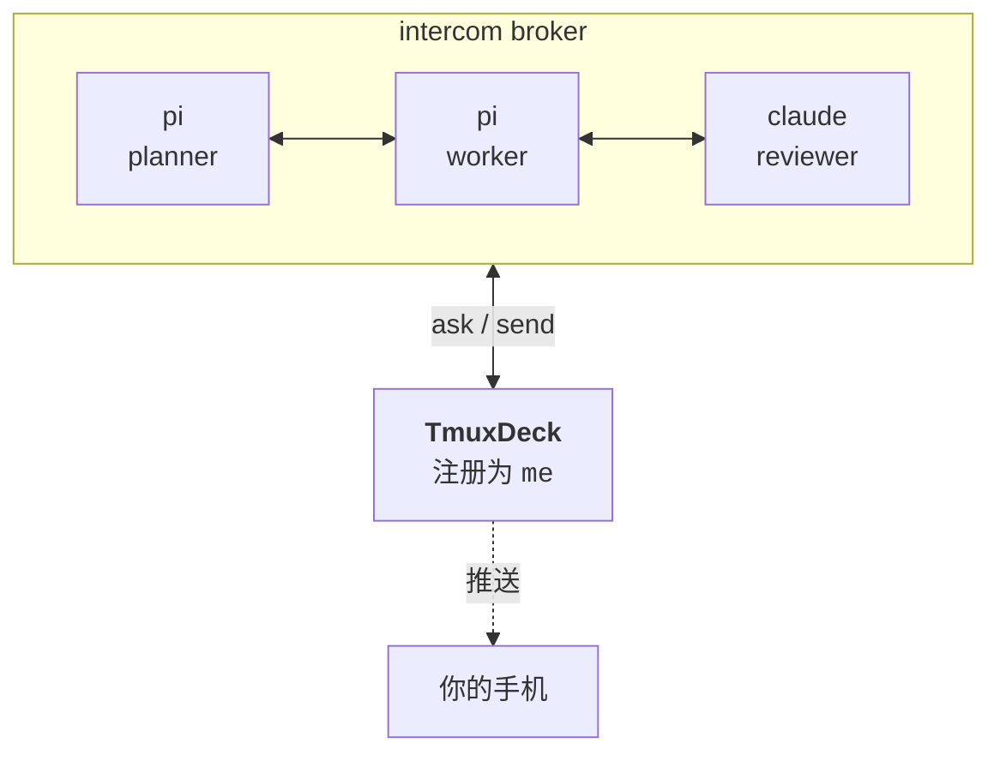
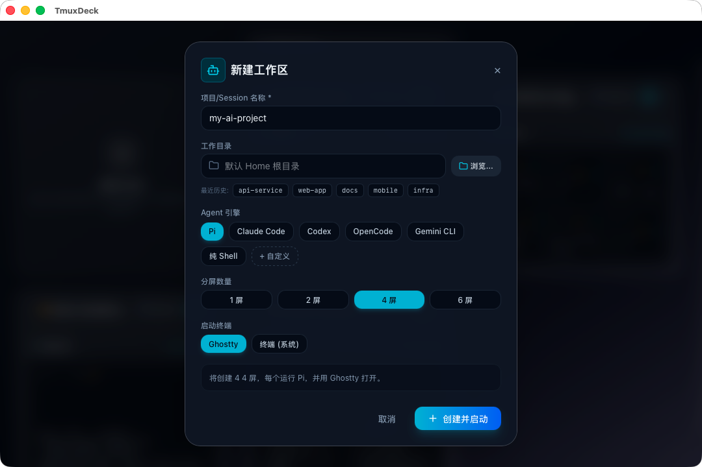

# TmuxDeck

*[English](README.md) · [简体中文](README.zh-CN.md)*

**十个 Agent 正在并行运行，哪一个正在等待你处理？**

TmuxDeck 是专为多 AI Coding Agent 打造的并行工作区控制台。每个 Agent 运行在独立的 tmux 分屏或会话中；TmuxDeck 为你统一展现所有工作区，实时标明哪些 Agent 需要人工确认，并支持一键交互。

基于 [Tauri](https://tauri.app/) 构建。macOS 为首要支持平台；Windows 支持通过 WSL 运行。



---

## 概述

- **多 Agent 并行编排。** 每个工作区即为一张卡片，实时展示分屏状态、运行命令与静默时长。
- **Native Ghostty 原生分屏。** 支持 1/2/4/6 屏无缝网格，每个 Agent 在独立的 tmux session 中运行 — 关闭终端窗口，Agent 在后台持续工作。
- **兼容经典终端工作流。** 完美支持经典单/多分屏 tmux 布局与系统各类常用终端。
- **开箱即用常用 Agent。** 运行时自动检测已安装的 Pi、Claude Code、Codex、OpenCode、Gemini CLI、Aider、自定义命令或纯 Shell。
- **一键掌控全局。** 在控制面板上一键新建、启动、恢复或销毁整套工作区与单 Agent 槽位。
- **常驻系统菜单栏。** 关闭主窗口后继续后台运行 — 状态监测、预览与控制随时一键拉起。
- **Agent 跨平台通信。** 自动注册至 Agent Intercom 消息总线，实现跨 Harness 发现、实时状态同步与定向消息交互。
- **macOS 优先，WSL 随时就绪。** 基于 Tauri 研发，Windows 环境支持在 WSL 中原生运行。

---

## 核心理念

运行一个 Agent 很简单 — 你看着它就行。但同时运行十几个 Agent，则是完全不同的挑战。

它们在不同的时间完成，在未预料的问题上阻塞，安静地等待；而一个卡住的 Agent 看起来和正在思考的 Agent 毫无区别。你的核心工作不再是*编写 Prompt*，而是**分诊 (Triage)**：在所有运行的工作区中，哪一个现在最需要我？

```
   ┌─ project-api ───────────┐   ┌─ mes-refactor ──────────┐
   │  ◐  pi        tool:bash │   │  ●  claude    thinking  │
   │  ○  pi        idle      │   │  ◐  codex     tool:edit │
   └─────────────────────────┘   └─────────────────────────┘

   ┌─ wms-migrate ───────────┐   ┌─ docs ──────────────────┐
   │  ●  pi        thinking  │   │  ▲  claude    waiting   │ ←── 等待你的决策
   │  ○  zsh                 │   │  ○  zsh                 │
   └─────────────────────────┘   └─────────────────────────┘

        ●  运行中      ◐  正在执行工具
        ○  空闲        ▲  等待人工输入
```

最后一张卡片就是关键所在。其他工作区都可以先等一等。

---

## 三层架构



**感知 (See)** — 每个会话呈现为一张卡片，每个分屏展示运行状态与静默时间。点击一次即可在选定的终端中重新附着。这是当前版本所提供的能力。

**交互 (Speak)** — 只有能够快速解除阻塞，卡住的 Agent 才有价值。TmuxDeck 支持向任意分屏发送文本，无需手动寻找终端窗口即可直接回复。

**无处不在 (Anywhere)** — 离开桌面时分诊需求依然存在。夜间阻塞的 Agent 会一直挂起直到次日，除非有移动端通知能及时触达你。

---

## Agent 之间已建立通信。你才是唯一的缺失参与者。

AI Coding Agent 正在形成它们自己的协作层 — [Agent Intercom](https://github.com/dataforxyz/agent-intercom-pi) 为 Pi、Codex、Claude Code 和 OpenCode 提供本地共享 Broker，使它们可以互相发现和发消息。

但这个总线此前唯独缺少**人类接口**。



TmuxDeck 在该 Broker 上注册为名为 `me` 的会话。Agent 需要决策时，联系你与联系其他 Agent 完全一致 — 并且因为 Broker 实时跟踪谁在空闲、谁在思考、谁在等待回复，**「哪个 Agent 需要我」这个问题由数据直接回答，无需猜测**。

> 状态：可信局域网移动端 UI 与桌面二维码配对已可用（仅限可信局域网明文传输）；真机验收与关屏/后台推送仍待后续完成。

---

## 功能特性

- **会话全局视图。** 每个 tmux 会话展示为卡片，标明窗口数、分屏数、各分屏指令及最后活跃时间。
- **一键新建工作区。** 指定名称、工作目录、Agent 引擎、分屏数与终端，自动创建分屏并拉起终端。
- **适配现有环境。** 运行时自动检测已安装的终端与 Agent，未安装的自动隐藏。终端支持：Ghostty、iTerm2、WezTerm、kitty、Alacritty、系统 Terminal。Agent 支持：Claude Code、Codex、OpenCode、Gemini CLI、Aider、Pi 或纯 Shell。
- **常驻系统菜单栏。** 关闭窗口后 TmuxDeck 仍在后台运行 — 无需重新打开主窗口即可快捷管理会话或创建工作区。
- **分屏格精细控制。** 支持独立终止单个分屏/槽位，或动态新增分屏扩展网格。
- **防止重复开窗。** 点击已附着的会话会自动聚焦现有终端窗口，不会重复创建冗余终端。
- **自动记忆设置。** 常用终端、Agent 与分屏数量自动保存到对应平台的配置目录。
- **零额外配置。** 在极简环境下，可无缝回退至系统终端与默认 Shell。

---

## 快速开始

### 1. 安装基础依赖与 Agent CLI

```bash
# 必需依赖：tmux 复用器
brew install tmux

# 可选：AI Agent CLI
npm install -g @earendil-works/pi-coding-agent
npm install -g @anthropic-ai/claude-code
npm install -g @openai/codex
npm install -g opencode-ai
```

### 2. 配置 Agent Intercom (可选)

开启跨 Harness 发现、实时状态同步与 Agent 间定向通信：

| Agent | 适配器安装命令 | 激活 / MCP 注册 |
| :--- | :--- | :--- |
| **Pi** | `pi install npm:@dataforxyz/agent-intercom-pi` | 启动自动加载（已有会话执行 `/reload`） |
| **Claude Code** | `npm install -g @dataforxyz/agent-intercom-claude`（提供 `cci`） | 普通 `claude`：`claude mcp add -s user claude-intercom -- claude-intercom-mcp`；TmuxDeck 优先使用交互式 `cci --tui` |
| **Codex** | `npm install -g @dataforxyz/agent-intercom-codex` | `codex mcp add codex-intercom -- codex-intercom-mcp` |
| **OpenCode** | `cd ~/.config/opencode && npm install @dataforxyz/agent-intercom-opencode` | 在 `opencode.json` 与 `tui.json` 中配置 `plugin.mjs` 和 `tui.mjs`；`tui.mjs` 提供 `/intercom`、`/intercom-name` 和 `/intercom-id` |

### 3. 使用 Intercom 指令

在不同 Agent 会话间通过共享 Broker 通信：

- **会话发现与消息路由：** 使用 `intercom_list`、`intercom_send`、`intercom_ask` 以及 `intercom_reply` 进行会话查找与消息交互。
- **Claude Code 接入说明：** 适配器包提供支持 Intercom 的 Claude 包装器 `cci`。普通 `claude` 通过已注册的 MCP 工具接入；`cci --tui` 还提供可唤醒的交互身份与快捷操作。TmuxDeck 仅在运行时确认 `cci` 可执行且支持 `--tui`、`--id`、`--name` 后才选择它，并为每个 legacy pane 或 Ghostty native slot 注入稳定唯一身份；若 `cci` 缺失、不可执行或版本不兼容，会无报错回退到独立检测到的普通 `claude`。选择器会显示当前模式：**Claude Code · Intercom (cci)** 或 **Claude Code · Standard**。自定义 Agent 命令不会被改写。可用 `/claude-intercom:intercom-id` 或 Alt+I 查看当前身份；自行启动 `cci` 的高级用户可显式指定 `--id <稳定-id> --name <名称>`。
- **OpenCode 接入说明：** 需要同时注册 `plugin.mjs`（服务端插件在 `opencode.json` 中）与 `tui.mjs`（TUI 插件在 `tui.json` 中）。
- **重命名 OpenCode Intercom 会话：** 执行 `/intercom-name`，或在命令面板选择 **Rename intercom session**；弹窗标题为 **Rename this Intercom session**。模型也可以调用 `intercom_set_name({ name: "<新名称>" })`。该操作只修改其他 Agent 可见的名称，不改变稳定的 Intercom Session ID。

详细配置说明请参阅 [docs/GUIDE-cross-harness-agent-intercom.md](docs/GUIDE-cross-harness-agent-intercom.md)。

---

## 环境要求

- macOS (Apple Silicon；Intel 支持通过源码构建)
- [tmux](https://github.com/tmux/tmux) — `brew install tmux`

终端和 Agent 工具均为可选；应用仅展示你已安装的选项。

## 安装指南

从 [Releases 页面](https://github.com/ctliz/TmuxDeck/releases) 下载最新版本的 Apple Silicon (`aarch64`) `.dmg`，将 `TmuxDeck.app` 拖入 Applications 目录即可。

发布版本已进行 Ad-hoc 签名但未完成公证。首次启动时，请在 `TmuxDeck.app` 图标上右键选择「打开」并确认。若 macOS 提示应用已损坏或无法打开，请执行以下命令清除标志：

```bash
xattr -cr /Applications/TmuxDeck.app
```

## 使用说明

1. 打开 TmuxDeck。
2. 点击 **新建工作区 (New Workspace)**。
3. 输入名称、选择目录、Agent、分屏数和终端。
4. 点击 **创建并启动 (Create & Start)**。



终端打开并自动附着至新会话。关闭终端窗口不会销毁工作区 — 会话依然在后台运行，可随时重新打开。只有点击卡片上的删除按钮才会彻底销毁会话。

## 配置项

配置文件在 macOS 位于 `~/Library/Application Support/tmuxdeck/config.json`，在 Windows 位于 `%APPDATA%\tmuxdeck\config.json`；应用会自动写回修改。

```json
{
  "default_terminal": "ghostty",
  "default_agent": "pi",
  "default_panes": 4,
  "custom_agent": { "name": "Claude Opus", "command": "claude --model opus" },
  "recent_dirs": ["/Users/you/projects/foo"]
}
```

`custom_agent` 可在创建弹窗中加入用户自定义的 Agent 执行指令。

## 常见问题 (FAQ)

**使用 TmuxDeck 是否必须安装 Ghostty 或 Claude Code？**

不需要。应用会自动检测已安装环境并隐藏未安装项。极简环境下使用系统终端和 Shell 即可运行。

**关闭 TmuxDeck 会关闭运行中的 Agent 吗？**

不会。工作区托管在 tmux 中而非应用进程内部。关闭应用或终端窗口后会话继续后台运行。只有明确点击卡片删除按钮才会销毁会话。

**必须配置 Agent Intercom 吗？**

不需要。未配置时 TmuxDeck 作为可视化仪表盘使用；配置后能获取精确状态判定，并允许 Agent 直接发消息触达你。

**为什么下拉列表中找不到我安装的终端？**

界面仅显示检测到的已安装终端。若某种类型只有单一选项会自动折叠。若安装在非标准路径未被探测到，欢迎在 GitHub 提交 Issue。

**TmuxDeck 支持 Linux 或 Windows 吗？**

暂不支持原生 Linux。Windows 支持在 WSL 中运行并提供安装包，但 macOS 为主测试平台 — 欢迎在 GitHub 报告 Windows 相关问题。

## 开发者指南

参见 [CONTRIBUTING.md](CONTRIBUTING.md) 了解开发配置与代码规范，参见 [docs/](docs/README.md) 了解架构设计、协议参考与决策记录。

## 开源协议

[MIT](LICENSE)
