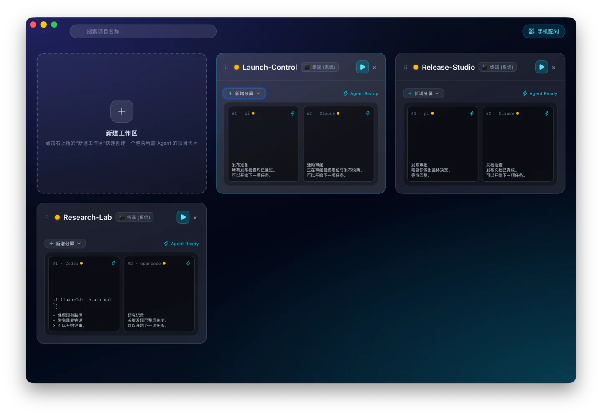
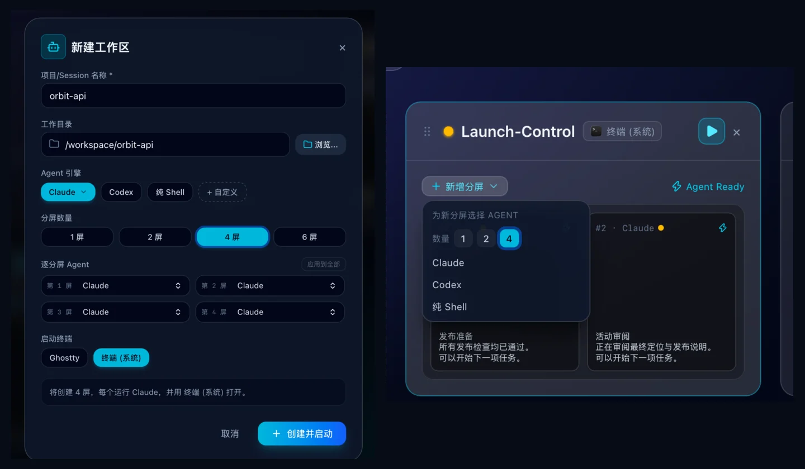
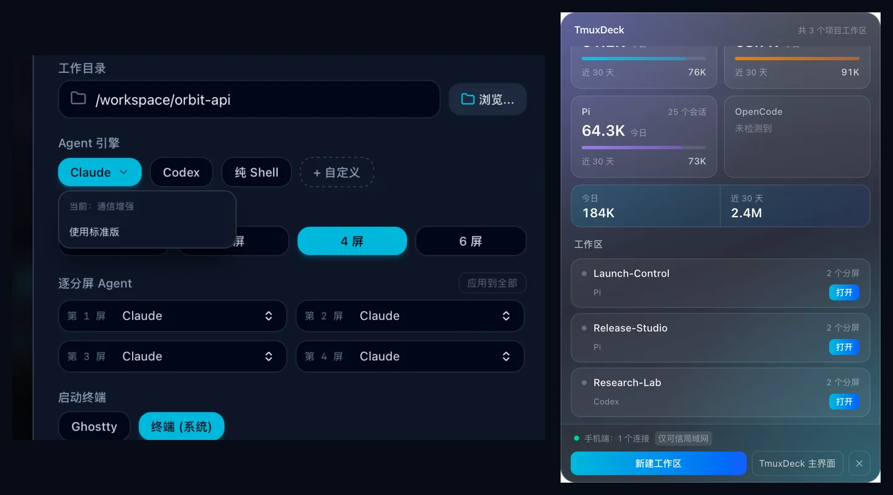
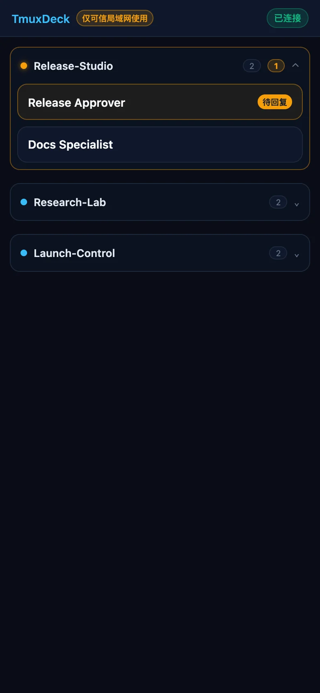
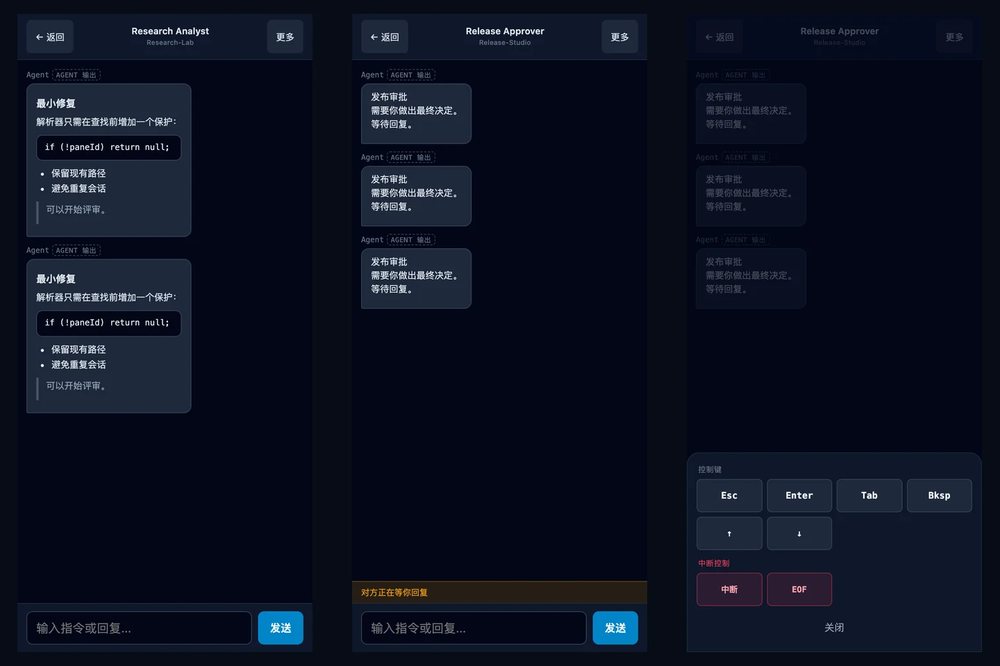
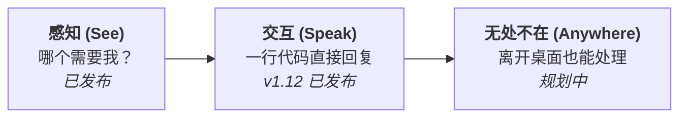
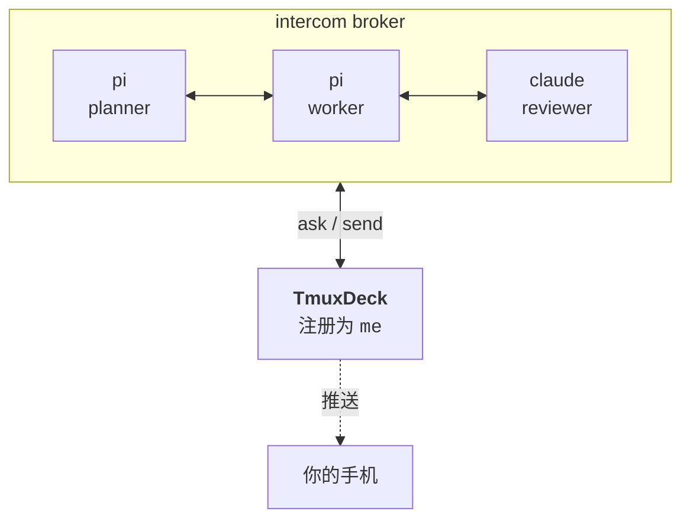

# TmuxDeck

*[English](README.md) · [简体中文](README.zh-CN.md)*

**十个 Agent 正在并行运行，哪一个正在等待你处理？**

TmuxDeck 是专为多 AI Coding Agent 打造的并行工作区控制台。每个 Agent 运行在独立的 tmux 分屏或会话中；TmuxDeck 为你统一展现所有工作区，实时标明哪些 Agent 需要人工确认，并支持一键交互。

基于 [Tauri](https://tauri.app/) 构建。macOS 为首要支持平台；Windows 支持通过 WSL 运行。



<p align="center"><em>一屏掌握所有工作区，立即找到正在等待你的 Agent。</em></p>

---

## 概述

- **多 Agent 并行编排。** 每个工作区即为一张卡片，实时展示分屏状态、运行命令与静默时长。
- **Native Ghostty 原生分屏。** 支持 1/2/4/6 屏无缝网格，每个 Agent 在独立的 tmux session 中运行 — 关闭终端窗口，Agent 在后台持续工作。
- **兼容经典终端工作流。** 完美支持经典单/多分屏 tmux 布局与系统各类常用终端。
- **开箱即用常用 Agent。** 运行时自动检测已安装的 Pi、Claude Code、Codex、OpenCode、Gemini CLI、Aider、自定义命令或纯 Shell。
- **一键掌控全局。** 在控制面板上一键新建、启动、恢复或销毁整套工作区与单 Agent 槽位。
- **常驻系统菜单栏。** 关闭主窗口后继续后台运行 — 状态监测、预览与控制随时一键拉起。
- **Agent 跨平台通信。** 自动注册至 Agent Intercom 消息总线，实现跨 Harness 发现、实时状态同步与定向消息交互。
- **macOS 优先，WSL 随时就绪。** 基于 Tauri 研发，Windows 环境支持在 WSL 中原生运行。

---

## 从工作区到回复

### 组织工作区



按需创建工作区，并可一次新增 **1、2 或 4 个分屏**。所选 Agent 会应用到本批次的全部新分屏；若创建失败，本批次会自动回退。

<details>
<summary><strong>更多桌面界面：Claude 通信与 Tray</strong></summary>



在 macOS 上，Claude 的托管通信健康时不会额外占用界面空间；只有主动打开菜单时，才显示标准版与通信增强之间的切换。关闭主窗口后，Tray 仍让工作区状态与快捷操作保持一键可达。

*Tray 使用生产 UI 与隔离演示数据展示；详见[截图来源说明](docs/images/v1.12/SOURCE-MANIFEST.md)。*

</details>

### 把待处理队列带在身边

<p align="center">
  
</p>

移动端按工作区组织对话，并将等待你处理的工作区置顶。



舒适阅读 Markdown 与代码，用一个 **发送** 完成回复，终端控制统一收进 **更多**。配对使用桌面端生成的私有配对 token；移动页面仅面向**可信局域网**，浏览器关闭后不提供离线推送。

---

## 核心理念

运行一个 Agent 很简单 — 你看着它就行。但同时运行十几个 Agent，则是完全不同的挑战。

它们在不同的时间完成，在未预料的问题上阻塞，安静地等待；而一个卡住的 Agent 看起来和正在思考的 Agent 毫无区别。你的核心工作不再是*编写 Prompt*，而是**分诊 (Triage)**：在所有运行的工作区中，哪一个现在最需要我？

```
   ┌─ project-api ───────────┐   ┌─ mes-refactor ──────────┐
   │  ◐  pi        tool:bash │   │  ●  claude    thinking  │
   │  ○  pi        idle      │   │  ◐  codex     tool:edit │
   └─────────────────────────┘   └─────────────────────────┘

   ┌─ wms-migrate ───────────┐   ┌─ docs ──────────────────┐
   │  ●  pi        thinking  │   │  ▲  claude    waiting   │ ←── 等待你的决策
   │  ○  zsh                 │   │  ○  zsh                 │
   └─────────────────────────┘   └─────────────────────────┘

        ●  运行中      ◐  正在执行工具
        ○  空闲        ▲  等待人工输入
```

最后一张卡片就是关键所在。其他工作区都可以先等一等。

---

## 三层架构



**感知 (See)** — 每个会话呈现为一张卡片，每个分屏展示运行状态与静默时间。点击一次即可在选定的终端中重新附着。这是当前版本所提供的能力。

**交互 (Speak)** — 只有能够快速解除阻塞，卡住的 Agent 才有价值。TmuxDeck 支持向任意分屏发送文本，无需手动寻找终端窗口即可直接回复。

**无处不在 (Anywhere)** — 离开桌面时分诊需求依然存在。夜间阻塞的 Agent 会一直挂起直到次日，除非有移动端通知能及时触达你。

---

## Agent 之间已建立通信。你才是唯一的缺失参与者。

AI Coding Agent 正在形成它们自己的协作层 — [Agent Intercom](https://github.com/ctliz/agent-intercom-pi) 为 Pi、Codex、Claude Code 和 OpenCode 提供本地共享 Broker，使它们可以互相发现和发消息。对于 Pi，TmuxDeck 推荐使用其 [GitHub 发布版本](https://github.com/ctliz/agent-intercom-pi/releases/tag/v0.12.0-connect.1) (`v0.12.0-connect.1`)，基于 Agent Intercom v4 协议并保留上游 `@dataforxyz` 溯源。

但这个总线此前唯独缺少**人类接口**。



TmuxDeck 在该 Broker 上注册为名为 `me` 的会话。Agent 需要决策时，联系你与联系其他 Agent 完全一致 — 并且因为 Broker 实时跟踪谁在空闲、谁在思考、谁在等待回复，**「哪个 Agent 需要我」这个问题由数据直接回答，无需猜测**。

> 状态：可信局域网移动端 UI 与桌面二维码配对已可用（仅限可信局域网明文传输）；真机验收与关屏/后台推送仍待后续完成。

---

## 功能特性

- **会话全局视图。** 每个 tmux 会话展示为卡片，标明窗口数、分屏数、各分屏指令及最后活跃时间。
- **一键新建工作区。** 指定名称、工作目录、Agent 引擎、分屏数与终端，自动创建分屏并拉起终端。
- **适配现有环境。** 运行时自动检测已安装的终端与 Agent，未安装的自动隐藏。终端支持：Ghostty、iTerm2、WezTerm、kitty、Alacritty、系统 Terminal。Agent 支持：Claude Code、Codex、OpenCode、Gemini CLI、Aider、Pi 或纯 Shell。
- **常驻系统菜单栏。** 关闭窗口后 TmuxDeck 仍在后台运行 — 无需重新打开主窗口即可快捷管理会话或创建工作区。
- **分屏格精细控制。** 支持独立终止单个分屏/槽位，或一次原子新增 1、2、4 个分屏；Native 工作区只重建一次布局。
- **按工作区组织移动端对话。** 可信局域网移动端使用后端权威工作区元数据分组 Agent，并提供紧凑的 Markdown 对话、待人工回复置顶、上下文操作与可靠的内容来源标识。
- **防止重复开窗。** 点击已附着的会话会自动聚焦现有终端窗口，不会重复创建冗余终端。
- **自动记忆设置。** 常用终端、Agent 与分屏数量自动保存到对应平台的配置目录。
- **零额外配置。** 在极简环境下，可无缝回退至系统终端与默认 Shell。

---

## 快速开始

### 1. 安装基础依赖与 Agent CLI

```bash
# 必需依赖：tmux 复用器
brew install tmux

# 可选：AI Agent CLI
npm install -g @earendil-works/pi-coding-agent
npm install -g @anthropic-ai/claude-code
npm install -g @openai/codex
npm install -g opencode-ai
```

### 2. 配置 Agent Intercom (可选)

开启跨 Harness 发现、实时状态同步与 Agent 间定向通信：

| Agent | 适配器安装命令 | 激活 / MCP 注册 |
| :--- | :--- | :--- |
| **Pi** | `pi install git:github.com/ctliz/agent-intercom-pi@v0.12.0-connect.1` | 启动自动加载；安装或更新后，所有已打开的 Pi 会话都需执行 `/reload`。采用 Agent Intercom v4 协议与 Broker 强制工作区隔离及 Zero-Manual-Join Auto-Team（需 Core 0.2.0 registry integrity 可用；npm 包 `@ctliz/agent-intercom-pi@connect` 亦可用）。 |
| **Claude Code** | macOS 可在“创建工作区”弹窗安装 TmuxDeck 固定版本的托管适配器 (`0.13.0-connect.1`，npm 对应 `@ctliz/agent-intercom-claude@connect`)；不会修改全局 npm。 | 可选“使用托管 Claude”（以 `--tui --safe` 运行）或持久切换为“标准 Claude”。已有全局 `cci` 保持不变，仍可作为自定义命令使用。 |
| **Codex** | `npm install -g @ctliz/agent-intercom-codex@connect` | `codex mcp add codex-intercom -- codex-intercom-mcp` |
| **OpenCode** | `cd ~/.config/opencode && npm install @ctliz/agent-intercom-opencode@connect` | 在 `opencode.json` 与 `tui.json` 中配置 `plugin.mjs` 和 `tui.mjs`；`tui.mjs` 提供 `/intercom`、`/intercom-name` 和 `/intercom-id` |

### 3. 使用 Intercom 指令

在不同 Agent 会话间通过共享 Broker 通信：

- **Broker 强制工作区发现与路由：** 在 Agent Intercom v4 中，`intercom_list({})` 默认仅返回当前工作区会话，并由 Broker 强制执行隔离。短名称与 ID 前缀严格在同工作区内解析；跨工作区发送消息必须指定**完整精确的 Session ID**。
- **Scope 为同 OS 用户隔离，非安全主体：** 工作区 Scope 用于防止日常交互串流，属于操作性路由边界，而非密码学认证/鉴权主体；信任边界依旧为同 OS 用户本地 Broker。
- **前端与移动端零原值暴露：** TmuxDeck 桌面控制台与移动端保持零原值暴露；后端为每个工作区独立维护 scoped human client 并统一聚合成全局会话视图。
- **遗留工作区 Fail-Closed：** 旧版本创建的缺少 Scope 元数据的工作区，在执行新增/重命名等操作时会 Fail-Closed，需重新创建工作区以获得完整 v4 隔离支持。
- **仅需对已安装的适配器协调升级：** 升级协议版本时，只需协调升级当前机器上已安装的 Agent 适配器即可。升级后在已打开的 Pi 会话中执行 `/reload` 并重启其他伴生适配器；无需安装未使用的 Agent 适配器。
- **Orchestrator 部署模式：** Orchestrator 为可选的 Linux/systemd 生命周期管理产物，处于 Broker 兼容集之外；macOS 上直接省略。
- **批量回复上下文：** 跨 provider/tool 循环保留回复上下文。同一发送者的普通消息批次默认回复最新消息；多个发送者共存时，需在 `intercom_reply({ to, message })` 中使用精确发送者名称或完整 Session ID。
- **Claude Code 接入说明：** macOS 可直接在“创建工作区”弹窗离线安装或修复固定版本的 **托管 Claude Intercom** (`0.13.0-connect.1`)。安装器会校验内置资源 SHA-256、拒绝不安全归档项、验证 Claude plugin → Monitor → runtime 完整链路，且不修改全局 npm。每个新建的托管 pane 或 Ghostty native slot 都会显式使用安全模式 (`--tui --safe`) 启动 Claude，并生成密码学随机的 Intercom ID，该 ID 随现有 pane/slot 生命周期保留，并附带可读的工作区/分屏名称；它只是路由元数据，不是认证凭据。“使用标准 Claude”会持久保存；安装/修复或选择“使用托管 Claude”会切回托管模式。Windows/WSL 保持原标准 Claude 行为。已有全局 `cci` 不会被自动视为 Managed，也不会被修改或删除；确有需要可用自定义 Agent 命令启动。自定义命令不会被改写。
- **OpenCode 接入说明：** 需要同时注册 `plugin.mjs`（服务端插件在 `opencode.json` 中）与 `tui.mjs`（TUI 插件在 `tui.json` 中）。
- **重命名 OpenCode Intercom 会话：** 执行 `/intercom-name`，或在命令面板选择 **Rename intercom session**；弹窗标题为 **Rename this Intercom session**。模型也可以调用 `intercom_set_name({ name: "<新名称>" })`。该操作只修改其他 Agent 可见的名称，不改变稳定的 Intercom Session ID。

详细配置说明请参阅 [docs/GUIDE-cross-harness-agent-intercom.md](docs/GUIDE-cross-harness-agent-intercom.md)；TmuxDeck 面板启动、身份、MCP、终端能力与故障排查请参阅[CLI 通信指南](docs/GUIDE-cli-communication.zh-CN.md)。

---

## 环境要求

- macOS (Apple Silicon；Intel 支持通过源码构建)
- [tmux](https://github.com/tmux/tmux) — `brew install tmux`

终端和 Agent 工具均为可选；应用仅展示你已安装的选项。

## 安装指南

从 [Releases 页面](https://github.com/ctliz/TmuxDeck/releases) 下载最新版本的 Apple Silicon (`aarch64`) `.dmg`，将 `TmuxDeck.app` 拖入 Applications 目录即可。

发布版本已进行 Ad-hoc 签名但未完成公证。首次启动时，请在 `TmuxDeck.app` 图标上右键选择「打开」并确认。若 macOS 提示应用已损坏或无法打开，请执行以下命令清除标志：

```bash
xattr -cr /Applications/TmuxDeck.app
```

## 使用说明

1. 打开 TmuxDeck。
2. 点击 **新建工作区 (New Workspace)**。
3. 输入名称、选择目录、Agent、分屏数和终端。
4. 点击 **创建并启动 (Create & Start)**。

终端打开并自动附着至新会话。关闭终端窗口不会销毁工作区 — 会话依然在后台运行，可随时重新打开。只有点击卡片上的删除按钮才会彻底销毁会话。

## 配置项

配置文件在 macOS 位于 `~/Library/Application Support/tmuxdeck/config.json`，在 Windows 位于 `%APPDATA%\tmuxdeck\config.json`；应用会自动写回修改。

```json
{
  "default_terminal": "ghostty",
  "default_agent": "pi",
  "default_panes": 4,
  "custom_agent": { "name": "Claude Opus", "command": "claude --model opus" },
  "recent_dirs": ["/Users/you/projects/foo"]
}
```

`custom_agent` 可在创建弹窗中加入用户自定义的 Agent 执行指令。

## 常见问题 (FAQ)

**使用 TmuxDeck 是否必须安装 Ghostty 或 Claude Code？**

不需要。应用会自动检测已安装环境并隐藏未安装项。极简环境下使用系统终端和 Shell 即可运行。

**关闭 TmuxDeck 会关闭运行中的 Agent 吗？**

不会。工作区托管在 tmux 中而非应用进程内部。关闭应用或终端窗口后会话继续后台运行。只有明确点击卡片删除按钮才会销毁会话。

**必须配置 Agent Intercom 吗？**

不需要。未配置时 TmuxDeck 作为可视化仪表盘使用；配置后能获取精确状态判定，并允许 Agent 直接发消息触达你。

**为什么下拉列表中找不到我安装的终端？**

界面仅显示检测到的已安装终端。若某种类型只有单一选项会自动折叠。若安装在非标准路径未被探测到，欢迎在 GitHub 提交 Issue。

**TmuxDeck 支持 Linux 或 Windows 吗？**

暂不支持原生 Linux。Windows 支持在 WSL 中运行并提供安装包，但 macOS 为主测试平台 — 欢迎在 GitHub 报告 Windows 相关问题。

## 开发者指南

参见 [CONTRIBUTING.md](CONTRIBUTING.md) 了解开发配置、代码规范以及贡献 Communication Connector / Adapter（Pi、Claude、Codex、OpenCode、Orchestrator、Agy）的指南；参见 [docs/](docs/README.md) 了解架构设计、协议参考与决策记录。

## 贡献者

- [@ctliz](https://github.com/ctliz) — 作者与维护者
- [Claude](https://claude.com/claude-code) — 通过 Claude Code 参与实现

## 开源协议

[MIT](LICENSE)
